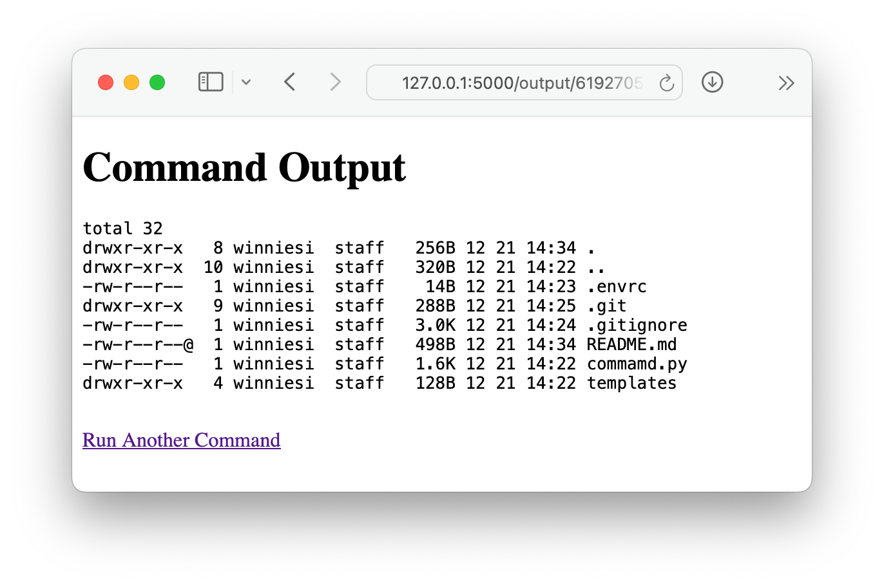

Run it, visit the URL, and you're all set to send terminal commands to the host via the webpage. The results will pop up right there on the page.

**Please note**, any command will be executed, which could be very **dangerous** for your computer. I can't think of any reason why you'd use it instead of SSH.

If you know what's going on, just go ahead and follow these steps.

```shell
git clone https://github.com/winniesi/FlaskCommandRunner.git
python3 -m pip install flask
python3 command.py
```



